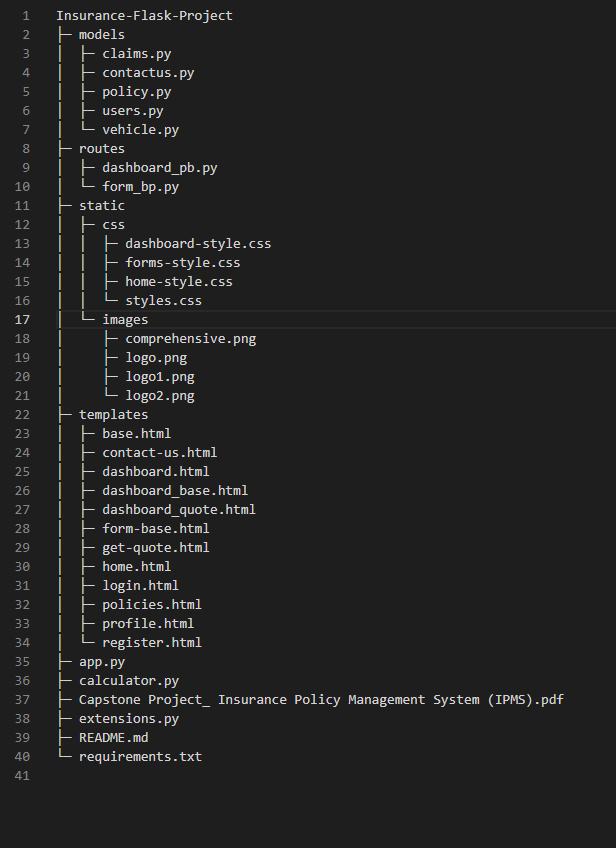

# InsureHub Website Documentation

## 1. Introduction
This is the documentation for the Flask-developed Insurance Policy Management System (IPMS) called InsureHub. Offering a full-stack development approach, the InsureHub is a comprehensive solution for managing insurance operations. It includes all of the necessary functions, including customer administration, policy management, claim processing, user registration and authentication, and a RESTful API for easy interaction with the website. The project is based on Flask and follows industry best practices, giving scalability and modularity top priority to guarantee flexibility and simplicity of maintenance.

## 2. Getting Started
Follow instructions as described in the `README.md` file.

## 3. User Registration & Authentication

### Secure User Registration
To register as a new user on the UnsureHub, follow these steps:
- Navigate to the registration page.
- Fill out the registration form with the required information, including username, password, email, and personal details.
- Submit the form to create a new user account.

### User Login & Logout
To log in to the InsureHub website, follow these steps:
- Navigate to the login page.
- Enter your username and password.
- Click on the "Login" button to access your account.
- To log out, click on the "Logout" button in the navigation bar.

## 4. Policy Management

### Creating a New Policy
To create a new insurance policy, follow these steps:
- Navigate to the `Get Quote` section once logged in.
- Fill out the policy details form, including policy type, car details.
-  Click `Calculate` button.
- Once quote has been calculated, click on the `Add Policy` button.
- Submit the form to create the policy.

### Claiming and Deleting Policies
To claim or delete existing policies, follow these steps:
- Navigate to the dashboard section once logged in.
- Find the policy you want to claim or delete.
- Click on the `More Info` button to view all the policy information.
- Click on the `Delete` button to remove the policy.
- Or click on the `Claim` button to claim that policy.

## 5. Customer Management

### Updating and Deleting Customers
To update or delete existing customers, follow these steps:
- Navigate to the profile settings section.
- Edit the fields you want updated, including personal details.
- Click on the `Update` button to update the customer details, or click on the "Delete" button to remove the customer.

## 6. RESTful API for Web App
API Endpoints
The IPMS provides the following RESTful API endpoints for interfacing with web applications:

- `/api/policies`: Endpoint for managing insurance policies (GET, POST, PUT, DELETE).
- `/api/claims`: Endpoint for managing insurance claims (GET, POST, PUT, DELETE).
- `/api/users`: Endpoint for managing user accounts (GET, POST, PUT, DELETE).
- `/api/auth`: Endpoint for user authentication (POST).
Authentication
To authenticate API requests, include the user's token in the request headers:

## 7. Project Structure

###  models/
- Contains Python files defining database models for various aspects of the system. Each file represents a different database table entity:
    - claims.py: Models for insurance claims.
    - contactus.py: Models for contact us inquiries.
    - policy.py: Models for insurance policies.
    - users.py: Models for user accounts.
    - vehicle.py: Models for vehicle details.
### routes/
- Contains Python files defining route handlers for different parts of the web application. Each file represents a Blueprint, a way to organize route handlers:
    - dashboard_pb.py: Blueprint for dashboard-related routes.
    - form_bp.py: Blueprint for form-related routes.
### static/
- Contains static assets such as CSS files and images used in the frontend.
    - css/: CSS files defining styles for different pages.
    - images/: Image files used in the web application.
### templates/
- Contains HTML templates used for rendering pages in the web application. Each HTML file represents a different page or component:
    - base.html: Base template extended by other templates.
    - contact-us.html: Template for the contact us page.
    - dashboard.html: Template for the dashboard page.
    - home.html: Template for the home page.
    - login.html: Template for the login page.
    - policies.html: Template for displaying insurance policies.
    - profile.html: Template for the user profile page.
    - register.html: Template for the registration page.
And others for specific functionalities.
### app.py
- Main entry point of the Flask application. Initializes the Flask app and registers Blueprints.
###  calculator.py
- This file is used for the getquote calculations.
### extensions.py
- Contains code related to Flask extensions used in the project, including sql_alchemy and login_manager.
### README.md
Documentation file providing installion of the project.

### requirements.txt
- Text file listing all Python dependencies required by the project.

## 8. Form Handling with Flask-WTF
Form handling in the Insurance Policy Management System (IPMS) is facilitated by the Flask-WTF extension, which integrates the WTForms library with Flask to create, validate, and render forms. Here's how the website uses form handling:

### Using Flask-WTF for Form Creation
- The website uses Flask-WTF to create forms for various functionalities, such as user registration, policy creation, and claim filing.
Each form is defined as a class that inherits from the FlaskForm class provided by Flask-WTF.
- Form fields are defined as class attributes, with each field corresponding to an input element in the HTML form.

### Form Validation
- Flask-WTF provides built-in support for form validation using WTForms validators.
- The website defines validation rules for each form field to ensure that user input meets the specified criteria.
- Common validators include InputRequired for ensuring a field is not submitted empty, Length for enforcing minimum and maximum length constraints, and Email for validating email addresses.

### Rendering Forms in Templates
- Once forms are defined, the website renders them in HTML templates using Jinja templating.
- Flask-WTF integrates seamlessly with Jinja, allowing the website to render form fields and handle form submission easily.
- The website uses the form object provided by Flask-WTF in templates to render form fields and display validation errors.

### Handling Form Submission
- When a user submits a form, Flask-WTF automatically validates the form data.
- If validation fails, Flask-WTF re-renders the form with error messages indicating the validation errors, using html flash.
- If validation passes, the website processes the form data, typically by saving it to the database or performing other necessary actions

## 9. API Authentication and Authorization
Authentication and authorization for the API endpoints in the Insurance Policy Management System (IPMS) are crucial for security. Here's how the website handles authentication and authorization:

### Authentication Mechanism
- The website implements token-based authentication for the API using JSON Web Tokens (JWT).
- When a user logs in or registers on the website, they receive a JWT token that they must include in the Authorization header of subsequent API requests.
- This token is generated using a secure algorithm and contains encoded information about the user, such as their user ID and role. To be implemented, if time allows.

### Authorization Policies
- The website defines authorization policies to control access to different API endpoints based on user roles and permissions.
- Each endpoint is associated with one or more authorization policies that determine whether a user is allowed to access the endpoint.
For example, only administrators may be allowed to access certain endpoints for managing policies or user accounts.

### Middleware for Authentication
- The website uses middleware in the Flask application to enforce authentication for protected API endpoints.
- This middleware intercepts incoming requests, verifies the JWT token in the Authorization header, and extracts user information from the token.
- If the token is valid, the middleware allows the request to proceed; otherwise, it returns an error response indicating that authentication is required.

### Handling Authorization Errors
- If a user attempts to access an API endpoint without the necessary permissions, the website returns an HTTP 403 Forbidden error response.
This informs the user that they are not authorized to perform the requested action and prevents unauthorized access to sensitive data or functionality.

